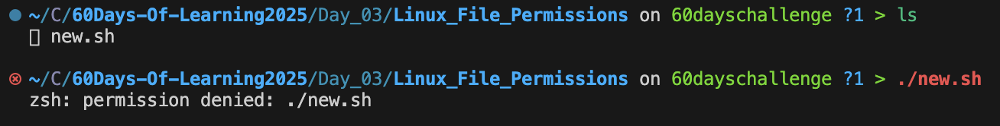

# Day 3: Linux File Permissions

Welcome to **Day 3** of the **LSPP Leapfrog 60 Days of Learning Challenge**!

Today, I dived into Linux file permissions using Red Hat’s blog and a YouTube explainer by TechHut.

---

## 📚 Learning Resources

- 📖 [Red Hat Blog: Linux File Permissions Explained](https://www.redhat.com/en/blog/linux-file-permissions-explained)
- 🎥 [YouTube: Linux File Permissions (TechHut)](https://www.youtube.com/watch?v=qGfSVUrrTt0)

---

## 🔐 What I Learned

### 🔍 File Permission Format

```bash
-rwxr-xr--
```

| Section     | Meaning                     |
|-------------|-----------------------------|
| `-`         | File type (`-` file, `d` directory) |
| `rwx`       | Owner permissions (read/write/execute) |
| `r-x`       | Group permissions (read/execute) |
| `r--`       | Others permissions (read only) |

---

### 👤 Ownership in Linux

Every file and directory has:

- **User**: The owner
- **Group**: The assigned group
- **Others**: Everyone else

Check ownership:

```bash
ls -l filename
```

Change ownership:

```bash
chown user:group filename
```

---

### ✏️ Changing Permissions

#### Symbolic Mode

```bash
chmod u+x script.sh    # Add execute permission to user
chmod g-w file.txt     # Remove write permission from group
chmod o+r file.txt     # Add read permission to others
```

#### Numeric Mode

```bash
chmod 755 script.sh    # rwxr-xr-x
chmod 644 file.txt     # rw-r--r--
```

| Number | Permission |
|--------|------------|
| 4      | Read       |
| 2      | Write      |
| 1      | Execute    |

So `chmod 755` is: `7 = rwx`, `5 = r-x`, `5 = r-x`

---

### 📁 Directory Permissions

Make directory accessible:

```bash
chmod +x folder/
```

Recursively set folder and contents:

```bash
chmod -R 755 folder/
```

---

### 🔄 Bonus Commands

Show default permission mask:

```bash
umask
```

Show detailed file info:

```bash
stat filename
```

---

### Example

```bash
# Create a new file
touch new.sh
```

Test file for testing excutable.



Check for the permission of the file.

```bash
# viewing the permission of the file
ls -l new.sh
#or
ls -la
```


Change the permission of the file.

```bash
chmod u=rwx,g=rx,o=rx new.sh
```


Executing the script file.

```bash
./new.sh
```


`#60DaysOfLearning` `#Linux` `#FilePermissions` `#LearningWithLeapfrog` `#FilePermissions` `LSPPDay03`
