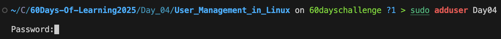
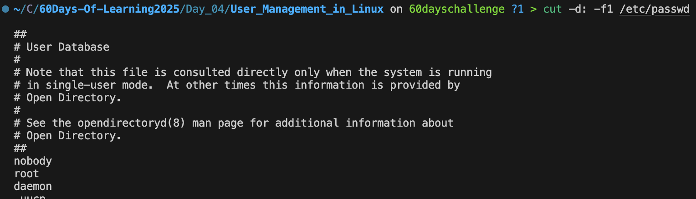
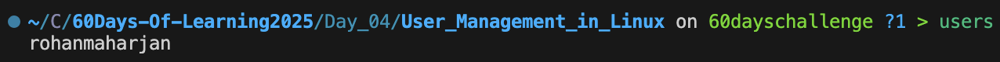

# 🚀 Day 4: Linux User and Group Management

Welcome to **Day 4** of the **LSPP Leapfrog 60 Days of Learning Challenge**!

Today’s focus: **User and Group Management in Linux**

---

## 📚 Resources Used

- [Linux Journey: Users and Groups](https://linuxjourney.com/lesson/users-and-groups)
- [GeeksForGeeks: User Management in Linux](https://www.geeksforgeeks.org/user-management-in-linux/)

---

## 👥 Understanding Users and Groups

In Linux, **users** and **groups** are core to permissions and security. Managing them properly is essential for system administration and multi-user environments.

---

## 🔎 How to View Users in Linux

### 1. View All System Users

```bash
cat /etc/passwd
```

Adding user :



To show only usernames:

```bash
cut -d: -f1 /etc/passwd
```



### 2. View Specific User Info

```bash
id <username>
```

### 3. View Currently Logged-in Users

```bash
who
```

or

```bash
w
```

or

```bash
users
```



### 4. View All Groups

```bash
cat /etc/group
```

### 5. View User Group Membership

```bash
groups <username>
```

```bash
groups <username>
```

### 6. View Login History

```bash
last <username>
```

### 7. View Password & Account Expiry Info

```bash
chage -l <username>
```

## ⚙️ Common User & Group Commands

| Command                        | Description              |
|-------------------------------|--------------------------|
| `useradd <username>`          | Add a new user           |
| `passwd <username>`           | Set password for user    |
| `usermod -aG group user`      | Add user to a group      |
| `groupadd <groupname>`        | Create a new group       |
| `groupdel <groupname>`        | Delete a group           |
| `userdel <username>`          | Delete a user            |
| `whoami`                      | Show current user        |

## ✅ Practice Commands Run Today

```bash
cat /etc/passwd
cut -d: -f1 /etc/passwd
id <username>
groups <username>
who
users
w
chage -l <username>
```

`#60DaysOfLearning` `#Linux` `#UserManagementinLinux` `#LearningWithLeapfrog` `#UserandGroup` `LSPPDay04`
